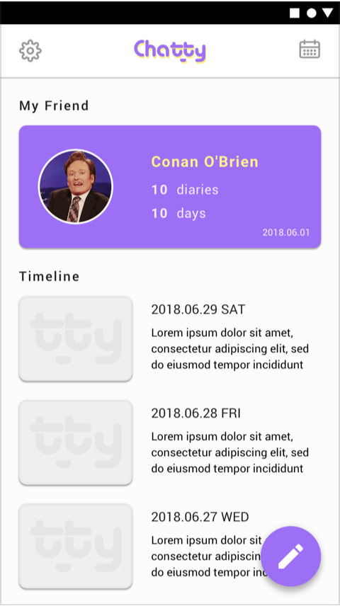
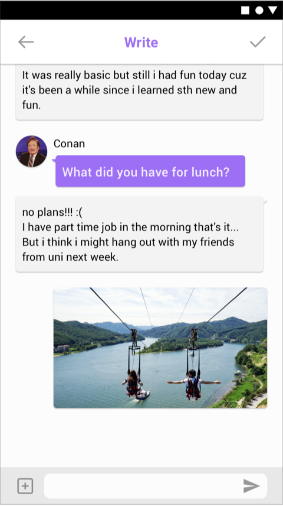

## Chatty 채팅식 다이어리 
* Android app
* Django
* PostgreSQL

## 앱 실행 화면






## API Specification

### Start Chat
채팅을 처음 시작했을 때

- Request
`POST /diary/startchat/`

  - Headers_
  Key: HASH
  Value: SE69KdAOBIMtjS6kZovvrOcmn2hrzO2DlVih6u4o (유저 고유 Hash)

- Response
//status : HTTP 201 Created
```
{
    "diary_id": 30, //새로 생성된 다이어리의 id
    "question": { // 첫 번째 질문
        "question_id": 1, //첫 번째 질문의 id
        "message": "오늘은 어떤 일이 있었나요 ?" //첫번째 질문
    }
}
```

### Diary Detail
다이어리 상세보기

- Request
`GET /diary/detail/:DiaryId/`

  - Header_
Key: HASH
Value: SE69KdAOBIMtjS6kZovvrOcmn2hrzO2DlVih6u4o (유저 고유 Hash)

- Response
//status : HTTP 200 OK

```
{  
    "partner": {
            "profile_image": "/media/스티브잡스.png",
            "name": "스티브 잡스"
        },
    "weather": "Rain",  // 날씨가 쓰여진 날의 날씨(자동생성)
    "feeling": "Soso" // 유저 감정
    "questions": [ // 질문 리스트
        {
            "question_id": 1, // 질문 id
            "message": "오늘은 어떤 일이 있었나요 ?" // 질문 message
        },
        {
            "question_id": 2,
            "message": "어제 세웠던 계획을 잘 이행했나요 ?"
        },
        {
            "question_id": 3,
            "message": "무슨 꿈을 꾸고 싶나요?"
        }
    ],
    "answers": [  // 유저 답변 리스트
        {
            "question": 1,  // 질문 id (어떤 질문에 대한 답변인지 알기 위함)
            "label": "1번째 답",  // 유저 답변 내용
            "image": "/media/IMG_7849.JPG",  // 유저 답변에 속한 image file
            "created_at": "2018-08-31T17:13:45.645057+09:00"  // 유저 답변 생성일
        },
        {
            "question": 2,
            "label": "2번째 답",
            "image": null,
            "created_at": "2018-08-31T17:23:19.186371+09:00"
        },
        {
            "question": 3,
            "label": "3번째 답",
            "image": null,
            "created_at": "2018-08-31T17:23:23.568736+09:00"
        }
    ],
    "created_at": "2018-07-26T17:14:08.446506+09:00" // 일기 생성일
}
```

+ 날씨 종류
1. Thunderstorm
2. Drizzle
3. Rain
4. Snow
5. Atmosphere
6. Clear
7. Clouds

### This Month Calendar
request가 이루어진 달의 달력

- Request
`GET /diary/calendar/`

  - Header_
Key: HASH
Value: SE69KdAOBIMtjS6kZovvrOcmn2hrzO2DlVih6u4o (유저 고유 Hash)

- Response
//status : HTTP 200 OK

```
// request가 이루어진 달에 쓰여진 일기들 (예: 7월달에 요청, 7월에 쓰여진 모든 일기들)
[ 
    {
        "diary_id": 31, // 다이어리의 id
        "created_at": "2018-07-25T19:03:45.179750+09:00" // 일기가 작성된 날짜, 시간
    },
    {
        "diary_id": 30,
        "created_at": "2018-07-25T17:28:01.763588+09:00"
    },
    {
        "diary_id": 29,
        "created_at": "2018-07-25T17:26:34.790342+09:00"
    },
    {
        "diary_id": 28,
        "created_at": "2018-07-25T17:26:26.348415+09:00"
    },
    {
        "diary_id": 27,
        "created_at": "2018-07-25T17:26:00.461616+09:00"
    }
]
```

### Other Month Calendar
request가 이루어진 달 외의 달력

- Request
`GET /diary/calendar/:Month/`

  - Header_
Key: Hash
Value: SE69KdAOBIMtjS6kZovvrOcmn2hrzO2DlVih6u4o (유저 고유 Hash)

- Response
//status : HTTP 200 OK

```
[  //url의 Month에 작성된 일기들
    {
        "diary_id": 33, // 다이어리의 id
        "created_at": "2018-08-02T19:03:45.179750+09:00" // 다이어리가 작성된 날짜, 시간
    },
    {
        "diary_id": 32,
        "created_at": "2018-08-01T17:28:01.763588+09:00"
    }
]
```

### Partner

파트너 생성하기

- Request
`Post  /partners/partner`

  - Headers_
Key: Hash
Value: SE69KdAOBIMtjS6kZovvrOcmn2hrzO2DlVih6u4o (유저 고유 Hash)

  - Body_
Key: profile_image
Value: 스크린샷 2018-08-13 (예시)

      Key: name (required field)
      Value: 스티브 잡스 (예시) 

      Key: bio
      Value: Simple! (예시)


- Response
// status: HTTP 201 CREATED

```
{
    "partner_id": "3", // 파트너 id
    "profile_image": "/media/코난.png", // 파트너 profile_image
    "name": "Conan O'Brien", // 파트너 name
    "bio": "I Love my show!" // 파트너 bio
}
```

### PartnerList

사용자가 생성한 파트너 리스트 보기

- Request
`Get /chatty_users/partners/`

  - Headers_
Key: Hash
Value: SE69KdAOBIMtjS6kZovvrOcmn2hrzO2DlVih6u4o (유저 고유 Hash)

- Response
// status: HTTP 200 OK
``` 
{
        "partners": [
                {
                    "id": 3, // 파트너 id
                    "profile_image": "/media/코난.png", // 파트너 profile_image
                    "name": "Conan O'Brien", // 파트너 name
                    "bio": "HAHA !!",  // 파트너 bio
                    "created_at": "2018-08-16" // 파트너가 생성된 날
                },
                {
                    "id": 2,
                    "profile_image": "/media/잡스.png",
                    "name": "Steve jobs",
                    "bio": "Simple !!",
                    "created_at": "2018-08-10"
                }
        ]
}
```
--------
### PartnerProfile

파트너 상세보기

- Request
`Get /partners/profile/:PartnerId/`

  - Headers_
Key: Hash
Value: SE69KdAOBIMtjS6kZovvrOcmn2hrzO2DlVih6u4o (유저 고유 Hash)

- Response
// status: HTTP 200 OK
```
{  
    "partner_id": 3, // 파트너 id
    "profile_image": "/media/코난.png", // 파트너 profile_image
    "name": "Conan O'Brien", // 파트너 name
    "bio": "I Love my show!", // 파트너 bio
    "diary_count": 0, // 해당 파트너와 함께한 일기 수, Read only 필드(수정불가능)
    "days_together": 1, // Days we've shared
    "created_at": "2018-08-16" // The first day we met
}
```

### PartnerProfile

파트너 수정하기

- Request
`Put /partners/profile/:PartnerId/`

  - Headers_
Key: Hash
Value: SE69KdAOBIMtjS6kZovvrOcmn2hrzO2DlVih6u4o (유저 고유 Hash)

- Response
// status: HTTP 200 OK

```
{
    "partner_id": 3, // 파트너 id
    "profile_image": "/media/코난.png", // 파트너 profile_image
    "name": "Conan", // 파트너 name 
    "bio": "I love Korea!!!", // 파트너 bio 
    "diary_count": 0, // 해당 파트너와 함께한 일기 수, Read only 필드(수정불가능)
    "days_together": 1, // Days we've shared, Read only 필드(수정불가능)
    "created_at": "2018-08-16" // The first day we met, Read only 필드(수정불가능)
}
```
----------
### SetPartner

request한 유저의 파트너 정하기 -> 정해진 파트너는 변경 이후에 작성되는 일기의 파트너로 자동 지정됨

- Request
`Put  /partners/mypartner/:PartnerId/`

  - Headers
Key: Hash
Value: SE69KdAOBIMtjS6kZovvrOcmn2hrzO2DlVih6u4o (유저 고유 Hash)
- Response
// status: HTTP 200 OK


### DeletePartner

파트너 삭제하기

- Request
`Delete /partners/partner/:PartnerId/`
  - Headers_
Key: Hash
Value: SE69KdAOBIMtjS6kZovvrOcmn2hrzO2DlVih6u4o (유저 고유 Hash)

- Response
// status: HTTP 204 NO CONTENT

### NewUser

새로운 유저 생성하기 / 새로운 유저의 고유한 해쉬값 받기

- Request
`Post /chatty_users/newuser/`

  - Body_
Key: kkong (required)
Value: leemirim

- Response
// status: HTTP 201 CREATED
```
{
    "name": "kkong", // 유저 name
    "unique_user_id": "mJV8yRmBmlD60TVkCUzz0cXBLaTtX3Tk3K3REIMW" // 유저 고유 Hash 값
}
```

### Main

메인 화면

- Request
`Get  /chatty_users/`

  - Headers_
Key: Hash
Value: SE69KdAOBIMtjS6kZovvrOcmn2hrzO2DlVih6u4o (유저 고유 Hash)


- Response
// status: HTTP 200 OK

```
{
    "partner": { // 사용자가 설정한 파트너의 프로필
        "partner_id": 2,  //파트너 id
        "name": "kkong",  // 파트너 이름
        "days_together": 2,  // Days we've shared, Read only 필드(수정불가능)
        "diary_count": 1  // 해당 파트너와 함께한 일기 수, Read only 필드(수정불가능)
    },
    "diaries": [ // 사용자가 작성한 일기 목룍
        {
            "diary_id": 2,
            "created_at": "2018-08-25T21:03:14.469332+09:00",  // 일기 생성일
            "answer": {
                "answer_id": 3,
                "image": null,
                "label": "3번 답변입니다." // 해당 일기의 가장 마지막 유저 답변
            }
        }
    ]
}
```

### Chat
처음 채팅 시작(startchat) 이후 채팅

- Request
`Post  /diary/chat/:DiaryId/`

  - Headers
Key: HASH
Value: SE69KdAOBIMtjS6kZovvrOcmn2hrzO2DlVih6u4o  (유저 고유 Hash)

  - Body
Key: label
Value: 1번째 답
Key: image
Value: 해당 이미지(이미지파일 형식)


- Response
// status:  HTTP 200 OK

```
{
    "question_id": 2,  // 다음 질문의 id
    "message": "2번 질문입니다."  // 다음 질문 내용
}
```

다음 질문이 더이상 존재하지 않을 경우 
- Response
// status: HTTP 204 No Content
-------------
### Main - Partner
메인 화면의 파트너 부분

- Request
`Get  /partners/main/`

  - Headers_
Key: HASH
Value: SE69KdAOBIMtjS6kZovvrOcmn2hrzO2DlVih6u4o (유저 고유 Hash)

- Response
```
{
    "partner_id": 1,  // 파트너의 id
    "profile_image": "/media/스티브잡스 사진.png", // 파트너 프로필 사진
    "name": "스티브 잡스", // 파트너의 이름
    "diary_count": 1  // 해당 파트너와 함께한 일기 수, Read only 필드(수정불가능)
    "days_together": 1, // Days we've shared, Read only 필드(수정불가능)
}
```

### Main - Diary
메인 화면의 유저가 작성한 일기 리스트

- Request
`Get  /diary/main/`
  - Headers_
Key: HASH
Value: SE69KdAOBIMtjS6kZovvrOcmn2hrzO2DlVih6u4o (유저 고유 Hash)

- Response
```
[
    {
        "diary_id": 2,  // 다이어리 id
        "created_at": "2018-08-31T17:06:31.004288+09:00",  // 해당 다이어리 생성일
        "last_answer": [  # 마지막 답변만 보내도록 수정할 예정임
            {
                "answer_id": 3,  // 유저 답변 id
                "image": null,  // 유저 답변에 속한 image
                "label": "3번째 답"  // 유저 답변 내용
            },
            {
                "answer_id": 2,
                "image": null,
                "label": "2번째 답"
            },
            {
                "answer_id": 1,
                "image": null,
                "label": "1번째 답"
            }
        ]
    }
]
```

### Feeling
일기를 모두 작성하고, 마지막 유저의 감정 받아오기

- Request
Put /diary/main/

  - Headers_
Key: HASH
Value: SE69KdAOBIMtjS6kZovvrOcmn2hrzO2DlVih6u4o (유저 고유 Hash)

    Key: feeling
    Value: Soso  (string type)

- Response
// status: HTTP 200 OK
```
{
    "diary_id": 13,
    "weather": "Rain",
    "feeling": "Soso", //Null 값에서 Soso 로 수정됨
    "questions": [
        {
            "question_id": 1,
            "message": "1번 질문입니다."
        },
        {
            "question_id": 2,
            "message": "2번 질문입니다."
        },
        {
            "question_id": 3,
            "message": "3번 질문입니다."
        }
    ],
    "answers": [
        {
            "question": 1,
            "label": "1번 입니다.",
            "image": "/media/%E1%84%89%E1%85%B3%E1%84%8F%E1%85%B3%E1%84%85%E1%85%B5%E1%86%AB%E1%84%89%E1%85%A3%E1%86%BA_2018-08-30_%E1%84%8B%E1%85%A9%E1%84%92%E1%85%AE_7.28.43.png",
            "created_at": "2018-09-03T18:23:12.824001+09:00"
        },
        {
            "question": 2,
            "label": "2번 입니다.",
            "image": "/media/KakaoTalk_Photo_2018-07-03-15-37-02.jpeg",
            "created_at": "2018-09-03T18:23:16.052984+09:00"
        },
        {
            "question": 3,
            "label": "3번 입니다.",
            "image": "/media/%E1%84%89%E1%85%B3%E1%84%8F%E1%85%B3%E1%84%85%E1%85%B5%E1%86%AB%E1%84%89%E1%85%A3%E1%86%BA_2018-08-13_%E1%84%8B%E1%85%A9%E1%84%92%E1%85%AE_5.04.40_ijzCcWL.png",
            "created_at": "2018-09-03T18:23:19.354476+09:00"
        }
    ],
    "created_at": "2018-09-03T18:21:15.797892+09:00"
}

```

### PartnerProfile_setting
setting에서 파트너 설정 상세페이지로 이동할 때 필요한 API

- Request
`Get /partners/mypartner/`

- Headers_
Key: HASH
Value: SE69KdAOBIMtjS6kZovvrOcmn2hrzO2DlVih6u4o (유저 고유 Hash)

- Response
// status: HTTP 200 OK

```
{
    "partner_id": 1,
    "profile_image": "/media/스티브잡스.png",
    "name": "스티브 잡스",
    "bio": "Simple !!",
    "diary_count": 4,
    "days_together": 26,
    "created_at": "2018-08-31"
}
```

